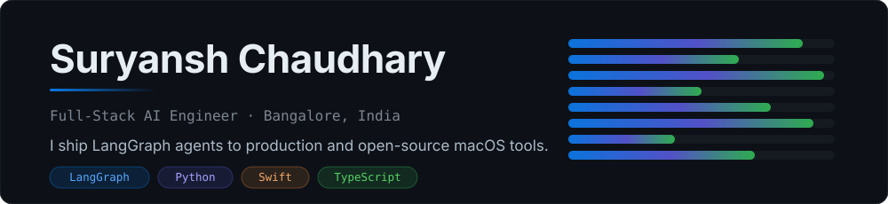
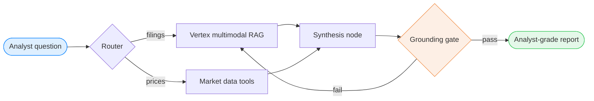

<picture>
  <source media="(prefers-color-scheme: dark)" srcset="./assets/hero-dark.svg">
  <source media="(prefers-color-scheme: light)" srcset="./assets/hero-light.svg">
  
</picture>

  <a href="https://suryansh.work"><b>Site</b></a> ·
  <a href="https://suryansh.work/blog"><b>Build logs</b></a> ·
  <a href="https://x.com/Suryansh_2001"><b>X</b></a> ·
  <a href="https://www.linkedin.com/in/suryansh-chaudhary-2209/"><b>LinkedIn</b></a> ·
  <a href="https://suryansh.work/suryansh.pdf"><b>Résumé</b></a>

---

## Now

- **MacGet 1.2** — YouTube & HLS downloads, browser-capture, signed auto-updates.
- **A multi-agent financial research desk** — LangGraph control plane, Vertex AI multimodal RAG data plane.
- **A build log every week** — the engineering, the trade-offs, and what broke.

---

## MacGet — native macOS download manager

<table>
<tr>
<td width="58%" valign="top">

 

Chunked HTTP parallelism that <b>adapts per host</b>, anti-leech CDN detection,
browser-extension capture over Native Messaging, and bundled <code>yt-dlp</code> for video.
Built in Swift on an actor-based concurrency engine — no polling, no shared mutable state.

 

<b>Free · Open source · macOS 26+</b>

</td>
<td width="42%" valign="top">

</td>
</tr>
</table>

> [!TIP]
> **[Download MacGet →](https://github.com/Suryansh-Codes2209/Macget/releases/latest/download/Macget.dmg)** — or read [how the download engine works](https://suryansh.work/blog/building-macget-download-engine).

---

## How I build agents

The shape I reach for on every production agent — explicit state, small nodes, a hard grounding gate before anything reaches a user.

Written up in full: [architecting a financial AI analyst](https://suryansh.work/blog/how-we-architect-a-financial-ai-analyst-multi-agent) · [hard gates and soft gates](https://suryansh.work/blog/langgraph-prompt-injection-hard-soft-gates)

---

## Stack

**Daily:** `LangGraph` `LangChain` `Python` `FastAPI` `TypeScript` `React` `Swift` `Google Cloud Run`

Everything else I work in

 

| Area | Tools |
|---|---|
| **AI / Agents** | LangGraph · LangChain · Vertex AI RAG · Gemini & Claude APIs · eval + guardrail design |
| **Backend** | Python · FastAPI · Django · Node.js · PostgreSQL · Redis · MongoDB |
| **Frontend** | TypeScript · React · Next.js · Tailwind · Framer Motion |
| **Native** | Swift · SwiftUI · structured concurrency / actors |
| **Infra** | Google Cloud Run · Docker · GitHub Actions · CI/CD |

---

## Latest build logs

<!-- BLOG-POST-LIST:START -->- [MCP servers vs agent skills: the payload is the integration](https://suryansh.work/blog/mcp-servers-vs-agent-skills-tool-payload-design) — Aug 3, 2026 - [MacGet 1.3.0: BitTorrent, book catalogs, and deleting my own adaptive concurrency](https://suryansh.work/blog/macget-1-3-0-bittorrent-book-catalogs-adaptive-concurrency) — Jul 30, 2026 - [Automating blog cover art with Gemini 3 Pro Image: my &#39;no legible text&#39; rule was the bug](https://suryansh.work/blog/automating-blog-cover-art-gemini-3-pro-image) — Jul 26, 2026 - [Claude Opus 5 vs Fable 5: how I&#39;m routing nodes in a LangGraph agent](https://suryansh.work/blog/claude-opus-5-vs-fable-5-routing-langgraph-agents) — Jul 26, 2026 <!-- BLOG-POST-LIST:END -->

<a href="https://suryansh.work/blog">All posts →</a>

---

## Activity

<picture>
  <source media="(prefers-color-scheme: dark)" srcset="./profile-summary-card-output/github_dark/2-most-commit-language.svg">
  
</picture>
<picture>
  <source media="(prefers-color-scheme: dark)" srcset="./profile-summary-card-output/github_dark/3-stats.svg">
  
</picture>

---

## Open to

- Collaborations on agent infrastructure and developer tooling
- Bug reports, feature ideas, and PRs on [MacGet](https://github.com/Suryansh-Codes2209/Macget)
- Talking shop about LangGraph, RAG evals, or Swift concurrency

**suryansh.codes2001@gmail.com**